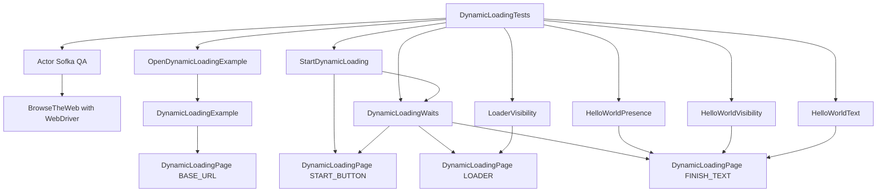

# Apuntes

## NoSuchElementException

Es una excepción en Java (y entornos como Selenium) que indica que se ha intentado acceder a un elemento que no existe en una colección, enumeración o página web.

---
---

## Implementacion de Selenium PURO

Voy a explicarlo **línea por línea**, indicando **qué significa, qué hace y cómo lo hace**.

Código:

```java
WebDriverWait wait = new WebDriverWait(driver,
    Duration.ofSeconds(10));

wait.until(ExpectedConditions
    .visibilityOfElementLocated(By.id("login")));
```

---

# 1️⃣ Primera línea

```java
WebDriverWait wait = new WebDriverWait(driver, Duration.ofSeconds(10));
```

## Qué significa

Se **declara e instancia un objeto de la clase `WebDriverWait`** para crear una **espera explícita** que controlará cuánto tiempo Selenium debe esperar por una condición.

---

## Qué hace

Crea un **mecanismo de espera inteligente** que:

* revisa constantemente el navegador
* hasta que una condición se cumpla
* o hasta que se alcance el tiempo máximo configurado.

En este caso:

**esperará hasta 10 segundos.**

---

## Cómo lo hace (parte por parte)

### `WebDriverWait`

Es una **clase de Selenium** ubicada en:

```
org.openqa.selenium.support.ui.WebDriverWait
```

Su función es implementar **esperas explícitas**.

Internamente utiliza:

* `FluentWait`
* polling periódico al DOM

---

### `wait`

Es **la variable que almacenará la instancia del objeto `WebDriverWait`**.

Tipo de dato:

```java
WebDriverWait
```

Sirve para luego llamar métodos como:

```java
wait.until(...)
```

---

### `=`

Es el **operador de asignación**.

Indica que la variable `wait` guardará el objeto que se crea a la derecha.

---

### `new WebDriverWait(...)`

Aquí se **instancia la clase**.

Esto significa que se crea **un nuevo objeto en memoria**.

Parámetros que recibe:

```java
WebDriverWait(WebDriver driver, Duration timeout)
```

---

### `driver`

Es la **instancia del navegador controlado por Selenium**.

Generalmente se declara antes:

```java
WebDriver driver = new ChromeDriver();
```

Este objeto permite que `WebDriverWait`:

* consulte el DOM
* verifique elementos
* ejecute polling

---

### `Duration.ofSeconds(10)`

Es una **clase de Java (`java.time.Duration`)** que representa un periodo de tiempo.

En este caso:

```java
Duration.ofSeconds(10)
```

significa:

**10 segundos como tiempo máximo de espera.**

Si la condición no ocurre en ese tiempo:

Selenium lanza una excepción:

```
TimeoutException
```

---

# 2️⃣ Segunda línea

```java
wait.until(ExpectedConditions.visibilityOfElementLocated(By.id("login")));
```

## Qué significa

Se le indica a Selenium:

> “Espera hasta que el elemento con id `login` sea visible en la página.”

---

## Qué hace

Ejecuta un **bucle interno de verificación (polling)** que:

1. consulta el DOM
2. busca el elemento
3. verifica si es visible
4. repite el proceso hasta que:

   * el elemento aparezca
   * o se cumpla el timeout.

---

## Cómo lo hace (parte por parte)

### `wait.until()`

Es un **método de la clase `WebDriverWait`**.

Firma simplificada:

```java
public <T> T until(Function<? super WebDriver, T> isTrue)
```

Lo que hace:

* recibe una **condición**
* evalúa repetidamente esa condición
* se detiene cuando devuelve **true o un objeto válido**.

---

### Polling interno

Por defecto Selenium revisa cada:

```
500 ms
```

El flujo sería algo así:

```
0 ms  -> busca el elemento
500 ms -> vuelve a buscar
1000 ms -> vuelve a buscar
1500 ms -> vuelve a buscar
...
hasta 10 segundos
```

---

### `ExpectedConditions`

Es una **clase utilitaria de Selenium**.

Paquete:

```
org.openqa.selenium.support.ui.ExpectedConditions
```

Contiene **condiciones predefinidas** como:

* `visibilityOfElementLocated`
* `elementToBeClickable`
* `presenceOfElementLocated`
* `titleContains`
* `alertIsPresent`

Estas condiciones son usadas por `until()`.

---

---

# Dynamic Loading - Ejercicio

## 1. Objetivo del documento

Este documento explica como funciona el proyecto de automatizacion Selenium con Serenity Screenplay desde tres perspectivas:

1. Como se relacionan las clases y que responsabilidad tiene cada una.
2. Que valida exactamente cada prueba y cada `assert`.
3. Que mejoras tecnicas conviene aplicar para hacer la suite mas robusta y mantenible.

## 2. Vision general del proyecto

El proyecto automatiza la pagina `https://the-internet.herokuapp.com/dynamic_loading` para demostrar el uso correcto de esperas explicitas sobre contenido asincrono.

La arquitectura esta organizada con Screenplay Pattern. Eso significa que el flujo no se escribe como una secuencia directa de Selenium dentro del test, sino separando las responsabilidades en componentes pequeños:

* `Actor`: representa al usuario o tester que interactua con la aplicacion.
* `Task`: representa acciones de negocio.
* `Question`: representa consultas al estado de la interfaz.
* `Target`: representa elementos del DOM.
* `Interaction` o utilidades de espera: encapsulan detalles tecnicos de sincronizacion.

## 3. Mapa de clases y responsabilidades

### 3.1 Clase de pruebas

Archivo: `src/test/java/com/sofka/dynamicloading/tests/DynamicLoadingTests.java`

Es el orquestador principal de los escenarios. Esta clase:

* crea el actor,
* le asigna la capacidad de navegar en el navegador,
* ejecuta tareas,
* invoca preguntas,
* y finalmente valida resultados con JUnit.

No contiene la logica tecnica de Selenium en detalle. Solo describe el flujo del escenario.

### 3.2 Capa `ui`

Archivo: `src/test/java/com/sofka/dynamicloading/ui/DynamicLoadingPage.java`

Esta clase centraliza los elementos visuales importantes:

* `BASE_URL`: URL base de la funcionalidad bajo prueba.
* `START_BUTTON`: boton que dispara la carga.
* `LOADER`: spinner o indicador de procesamiento.
* `FINISH_TEXT`: texto final `Hello World!`.

Su objetivo es evitar que los selectores CSS esten dispersos en todo el proyecto.

### 3.3 Capa `models`

Archivo: `src/test/java/com/sofka/dynamicloading/models/DynamicLoadingExample.java`

Es un `enum` que representa las dos variantes de la pagina:

* `EXAMPLE_1`
* `EXAMPLE_2`

Cada opcion guarda su path y construye la URL final usando `DynamicLoadingPage.BASE_URL`.

Este diseño evita duplicar tareas como `OpenExample1` y `OpenExample2`.

### 3.4 Capa `tasks`

Archivos:

* `src/test/java/com/sofka/dynamicloading/tasks/OpenDynamicLoadingExample.java`
* `src/test/java/com/sofka/dynamicloading/tasks/StartDynamicLoading.java`

Las `Task` representan acciones del usuario.

#### `OpenDynamicLoadingExample`

Responsabilidad:

* recibir el ejemplo a abrir,
* construir la navegacion,
* abrir la URL correcta.

Internamente usa `Open.url(example.url())`.

#### `StartDynamicLoading`

Responsabilidad:

* esperar a que el boton `Start` este listo,
* hacer clic sobre el boton.

Esta task no solo hace clic. Tambien protege la accion con una espera explicita previa para reducir fallos por sincronizacion.

### 3.5 Capa `interactions`

Archivo: `src/test/java/com/sofka/dynamicloading/interactions/DynamicLoadingWaits.java`

Esta clase encapsula las esperas explicitas reutilizables del proyecto.

Metodos principales:

* `untilStartButtonIsReady()`
* `untilLoaderIsVisible()`
* `untilLoaderDisappears()`
* `untilHelloWorldIsVisible()`

Internamente usa `WaitUntil` de Serenity con un timeout comun de 15 segundos.

Su valor tecnico es alto porque concentra la sincronizacion en un solo punto. Si mañana cambia el timeout o la estrategia de espera, se actualiza aqui y no en todas las pruebas.

### 3.6 Capa `questions`

Archivos:

* `src/test/java/com/sofka/dynamicloading/questions/HelloWorldPresence.java`
* `src/test/java/com/sofka/dynamicloading/questions/HelloWorldVisibility.java`
* `src/test/java/com/sofka/dynamicloading/questions/HelloWorldText.java`
* `src/test/java/com/sofka/dynamicloading/questions/LoaderVisibility.java`

Las `Question` no ejecutan acciones. Solo leen el estado actual de la pagina.

#### `HelloWorldPresence`

Responde si el elemento final existe o no en el DOM.

Esta distincion es importante porque un elemento puede existir pero seguir oculto.

#### `HelloWorldVisibility`

Responde si el texto final esta visible en pantalla.

Tiene un `try/catch` para devolver `false` si el elemento aun no puede resolverse.

#### `HelloWorldText`

Lee el texto visible final y aplica `trim()` para compararlo limpiamente.

#### `LoaderVisibility`

Responde si el loader se encuentra visible en ese momento.

## 4. Diagrama de flujo de clases y relaciones

### 4.1 Diagrama estructural



### 4.2 Flujo de ejecucion de un escenario

```mermaid
sequenceDiagram
    participant Test as DynamicLoadingTests
    participant Actor as Actor
    participant TaskOpen as OpenDynamicLoadingExample
    participant TaskStart as StartDynamicLoading
    participant Waits as DynamicLoadingWaits
    participant Page as DynamicLoadingPage
    participant Questions as Questions

    Test->>Actor: attemptsTo(OpenDynamicLoadingExample.page(example))
    Actor->>TaskOpen: performAs(actor)
    TaskOpen->>Page: usa BASE_URL y path del ejemplo

    Test->>Actor: attemptsTo(StartDynamicLoading.process())
    Actor->>TaskStart: performAs(actor)
    TaskStart->>Waits: untilStartButtonIsReady()
    TaskStart->>Page: Click START_BUTTON

    Test->>Actor: attemptsTo(untilLoaderIsVisible())
    Test->>Actor: attemptsTo(untilLoaderDisappears())
    Test->>Actor: attemptsTo(untilHelloWorldIsVisible())

    Test->>Questions: asksFor(...)
    Questions->>Page: consulta loader o finish text
    Questions-->>Test: devuelve boolean o texto
```

## 5. Como interactuan realmente las clases

La interaccion entre clases sigue este orden:

1. `DynamicLoadingTests` define el escenario.
2. El `Actor` ejecuta `Task` mediante `attemptsTo(...)`.
3. Las `Task` usan `Target` y utilidades de espera para operar sobre la UI.
4. `DynamicLoadingWaits` consulta objetivos definidos en `DynamicLoadingPage`.
5. Las `Question` vuelven a consultar esos mismos `Target`, pero solo para leer estado.
6. JUnit compara el resultado de las preguntas contra el comportamiento esperado.

Este diseño desacopla tres cosas que en proyectos mas basicos suelen quedar mezcladas:

* la navegacion,
* la sincronizacion,
* y la validacion.

## 6. Explicacion prueba por prueba y assert por assert

## 6.1 Prueba 1: `shouldDisplayHelloWorldInExample1`

Objetivo funcional:

Validar que en el Example 1 el mensaje `Hello World!` ya existe en el DOM desde el inicio, pero esta oculto, y solo se vuelve visible despues del proceso de carga.

Flujo:

1. Abre `EXAMPLE_1`.
2. Verifica el estado inicial del mensaje final.
3. Hace clic en `Start`.
4. Espera a que el loader aparezca.
5. Espera a que el loader desaparezca.
6. Espera a que `Hello World!` sea visible.
7. Valida el texto final.

### Assert 1

```java
assertTrue(tester.asksFor(HelloWorldPresence.inTheDom()));
```

Que valida:

* que el elemento `#finish h4` ya existe en el DOM antes de iniciar el proceso.

Por que importa:

* prueba una caracteristica propia del Example 1: el contenido existe, pero esta oculto.

### Assert 2

```java
assertFalse(tester.asksFor(HelloWorldVisibility.displayed()));
```

Que valida:

* que el texto aun no es visible al usuario antes de pulsar `Start`.

Por que importa:

* diferencia presencia en DOM de visibilidad real en pantalla.

### Assert 3

```java
assertEquals(EXPECTED_TEXT, tester.asksFor(HelloWorldText.displayed()));
```

Que valida:

* que despues del flujo asincrono el texto visible final es exactamente `Hello World!`.

Por que importa:

* confirma que la espera no solo encontro un elemento visible, sino el contenido correcto.

## 6.2 Prueba 2: `shouldRenderHelloWorldInExample2`

Objetivo funcional:

Validar que en el Example 2 el contenido final no existe al principio y se renderiza solo despues del procesamiento.

Flujo:

1. Abre `EXAMPLE_2`.
2. Verifica que el texto final no existe aun en el DOM.
3. Hace clic en `Start`.
4. Espera visibilidad del loader.
5. Espera desaparicion del loader.
6. Espera a que aparezca `Hello World!`.
7. Valida presencia y texto.

### Assert 1

```java
assertFalse(tester.asksFor(HelloWorldPresence.inTheDom()));
```

Que valida:

* que antes de iniciar el flujo, el nodo final todavia no fue renderizado.

Por que importa:

* confirma la diferencia esencial entre Example 1 y Example 2.

### Assert 2

```java
assertTrue(tester.asksFor(HelloWorldPresence.inTheDom()));
```

Que valida:

* que el elemento fue creado o insertado en el DOM despues del procesamiento.

Por que importa:

* verifica que el contenido realmente se renderizo y no solo que hubo una animacion visual.

### Assert 3

```java
assertEquals(EXPECTED_TEXT, tester.asksFor(HelloWorldText.displayed()));
```

Que valida:

* que el contenido final generado coincide exactamente con el valor esperado.

## 6.3 Prueba 3: `shouldHideLoaderBeforeShowingHelloWorld`

Objetivo funcional:

Validar la secuencia de sincronizacion: el loader debe desaparecer antes de afirmar el mensaje final.

Flujo:

1. Abre `EXAMPLE_1`.
2. Hace clic en `Start`.
3. Espera que el loader aparezca.
4. Espera que el loader desaparezca.
5. Espera visibilidad de `Hello World!`.
6. Verifica que el loader ya no esta visible.
7. Verifica que el texto final si esta visible.
8. Verifica el texto exacto.

### Assert 1

```java
assertFalse(tester.asksFor(LoaderVisibility.displayed()));
```

Que valida:

* que el spinner ya no esta visible al momento de evaluar el resultado.

Por que importa:

* asegura que la prueba no esta afirmando demasiado temprano.

### Assert 2

```java
assertTrue(tester.asksFor(HelloWorldVisibility.displayed()));
```

Que valida:

* que el contenido final ya es visible para el usuario.

### Assert 3

```java
assertEquals(EXPECTED_TEXT, tester.asksFor(HelloWorldText.displayed()));
```

Que valida:

* que el mensaje final visible es el esperado.

## 7. Diferencia tecnica entre presencia y visibilidad

Este proyecto ilustra una distincion clave en automatizacion web:

* `presence`: el elemento existe en el DOM.
* `visibility`: el elemento se muestra realmente al usuario.

En Example 1:

* antes del click, hay presencia pero no visibilidad.

En Example 2:

* antes del click, no hay presencia ni visibilidad.

Esta distincion hace que las pruebas sean mas precisas y evita falsos positivos.

## 8. Mejoras tecnicas posibles

Las siguientes mejoras estan ordenadas por impacto y utilidad.

### 8.1 Corregir y endurecer localizadores

La clase `DynamicLoadingPage` usa este selector para el boton:

```java
locatedBy("#start button")
```

Ese selector funciona si existe un `button` descendiente dentro de `#start`, pero es mas fragil que un selector mas directo.

Mejora sugerida:

* usar un selector mas explicito si la estructura lo permite, por ejemplo `#start button`, `#start > button` o incluso un locator mas semantico validado contra la pagina actual.

Lo importante no es solo que funcione hoy, sino que exprese claramente la intencion.

### 8.2 Centralizar por completo el flujo de negocio

Hoy el test sigue orquestando explicitamente estas esperas:

* loader visible,
* loader oculto,
* hello world visible.

Eso esta bien, pero aun deja detalles tecnicos dentro del test.

Mejora sugerida:

* crear una task mas rica, por ejemplo `CompleteDynamicLoading.process()`, que agrupe clic y sincronizacion completa.

Ventaja:

* los tests quedarian mas cercanos al lenguaje de negocio.

Riesgo:

* si se agrupa demasiado, se puede perder visibilidad sobre pasos intermedios. Conviene hacerlo solo si la suite crece y esos pasos se repiten mucho.

### 8.3 Reemplazar `try/catch` genericos por manejo mas preciso

En `HelloWorldVisibility` y `LoaderVisibility` se captura `Exception` de forma amplia para devolver `false`.

Mejora sugerida:

* capturar excepciones mas especificas o usar metodos de Serenity que expresen mejor el caso esperado.

Ventaja:

* se evita esconder errores reales de localizacion o configuracion.

### 8.4 Externalizar timeouts

El timeout de 15 segundos esta hardcodeado en `DynamicLoadingWaits`.

Mejora sugerida:

* mover el timeout a `serenity.properties`, variables de entorno o una clase de configuracion.

Ventaja:

* facilita ajustar la suite segun entorno local, CI o ejecucion remota.

### 8.5 Mejorar trazabilidad con nombres mas orientados al dominio

Los nombres actuales son correctos, pero pueden evolucionar hacia lenguaje mas funcional.

Ejemplos:

* `StartDynamicLoading` podria pasar a `TriggerDynamicLoad`.
* `HelloWorldText` podria pasar a `DisplayedResultText` si el proyecto creciera a mas mensajes.

No es obligatorio cambiarlo ahora. Solo es una mejora de escalabilidad semantica.

### 8.6 Integrar BDD ejecutable real si el objetivo del curso o equipo lo requiere

Existe un archivo `.feature`, pero actualmente funciona como documentacion viva y no como ejecutor real del flujo.

Mejora sugerida:

* integrar Cucumber con Serenity si se quiere trazabilidad BDD completa.

Ventaja:

* el lenguaje de negocio pasaria a ser parte directa de la ejecucion.

Costo:

* agrega complejidad estructural y mantenimiento de step definitions.

### 8.7 Reducir dependencia exclusiva de pruebas UI

La suite esta bien para una demostracion de sincronizacion, pero en proyectos reales no conviene depender solo de pruebas end-to-end.

Mejora sugerida:

* complementar con pruebas de capas inferiores cuando exista logica reusable fuera del navegador.

Ventaja:

* mejora velocidad, estabilidad y diagnostico.

### 8.8 Agregar validaciones sobre mensajes de error y reporting

Hoy los asserts validan el resultado feliz. Falta cubrir fallos de sincronizacion o diagnosticos mas ricos.

Mejora sugerida:

* agregar mensajes descriptivos en asserts o envolver validaciones en preguntas mas expresivas.

Ejemplo conceptual:

```java
assertEquals(EXPECTED_TEXT, tester.asksFor(HelloWorldText.displayed()),
        "El texto final visible no coincide con el esperado despues de completar la carga dinamica");
```

### 8.9 Revisar alineacion entre Java configurado y JDK operativo

El build declara compatibilidad con Java 21, pero la evidencia operativa del proyecto muestra ejecucion validada con un JDK 25 completo.

Mejora sugerida:

* alinear la version configurada, documentada y realmente usada en CI o en VS Code.

Ventaja:

* reduce diferencias entre entorno de desarrollo y ejecucion.

## 9. Conclusiones

El proyecto esta bien estructurado para una suite pequena de automatizacion UI con Screenplay. La separacion entre `ui`, `models`, `tasks`, `interactions`, `questions` y `tests` es correcta y facilita leer el flujo.

Su punto mas fuerte es la forma en que trata la sincronizacion: sin `Thread.sleep()`, con esperas explicitas reutilizables y con una distincion clara entre presencia, visibilidad y texto final.

Su principal oportunidad de mejora esta en endurecer la robustez tecnica para crecer mejor:

* localizadores mas expresivos,
* manejo de excepciones mas fino,
* timeouts configurables,
* y, si el alcance del proyecto lo justifica, una capa BDD ejecutable real.

En su estado actual, el proyecto cumple bien como ejemplo profesional de automatizacion con Selenium, Serenity y Screenplay orientado a cargas dinamicas.
